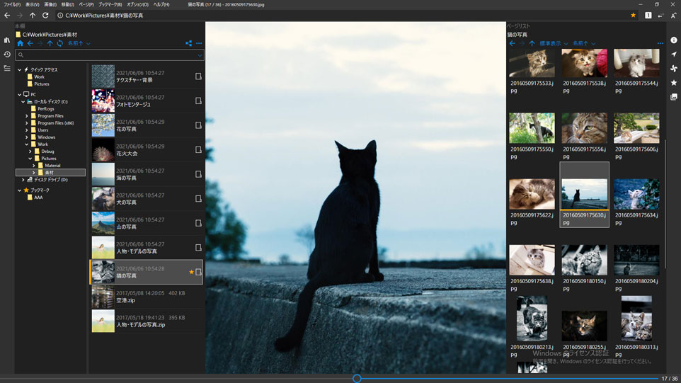

# NeeView

----

  フォルダー内の画像を本のように閲覧できる画像ビューアーです。  
  使い方は[こちらのページ](UserGuide)を参照してください。

## :pushpin: ダウンロード
(2025-01-12)

  * [ダウンロードページ](https://bitbucket.org/neelabo/neeview/downloads/)
    * [NeeView42.5.msi](https://bitbucket.org/neelabo/neeview/downloads/NeeView42.5.msi) (インストーラー版)
    * [NeeView42.5.zip](https://bitbucket.org/neelabo/neeview/downloads/NeeView42.5.zip) (ZIP版)
    * [NeeView42.5-fd.zip](https://bitbucket.org/neelabo/neeview/downloads/NeeView42.5-fd.zip) (ZIP-fd版。.NET8ランタイムのインストールが別途必要)
  * [Microsoft Store](https://www.microsoft.com/store/apps/9p24z53hc1jr) (ストアアプリ)
  * [Vectorからダウンロード](https://www.vector.co.jp/soft/winnt/art/se512262.html)

## :pushpin: 更新履歴

  * [更新履歴](ChangeLog)
  * [既知の不具合](https://bitbucket.org/neelabo/neeview/issues?kind=bug&status=wontfix&status=resolved&status=open&status=new)

## :pushpin: 動作環境

  * Windows 10, Windows 11 (64bit)

## :pushpin: 特徴

  * 標準対応画像フォーマット (bmp, jpg, gif, tiff, png, ico, svg, WIC対応画像)
  * 圧縮ファイル対応 (zip, rar, 7z, lzh, cbr, cbz, cb7, ...)
  * 多重圧縮ファイル対応
  * PDF対応
  * 動画対応
  * タッチ操作対応
  * マウスジェスチャー対応
  * キーカスタマイズ、ジェスチャ設定可能
  * ドラッグによる移動、回転、拡縮
  * ルーペモード
  * 見開き表示モード
  * フルスクリーンモード
  * スライドショー機能
  * Susieプラグイン対応
  * マルチスレッド、先読み対応
  * Webブラウザからの画像ドロップ

## :pushpin: 目次

 * [ユーザーガイド](UserGuide)
 * [起動オプション](BootOption)
 * [環境変数](EnvironmentValue)
 * [テーマファイル仕様](Theme)
 * パッケージの種類
     * [ZIP版について](Package-Zip)
     * [ZIP-fd版について](Package-ZipFd)
     * [インストーラー版について](Package-Installer)
     * [ストアアプリについて](Package-StoreApp)
     * [Canary版について](Package-Canary)
     * [Beta版について](Package-Beta)
 * [更新履歴](ChangeLog)
 * [既知の不具合](KnownProblem)
 * [Q&A](QuestionAndAnswer)
 * [プライバシーポリシー](PrivacyPolicy)
 * [問い合わせ先](Contact)

